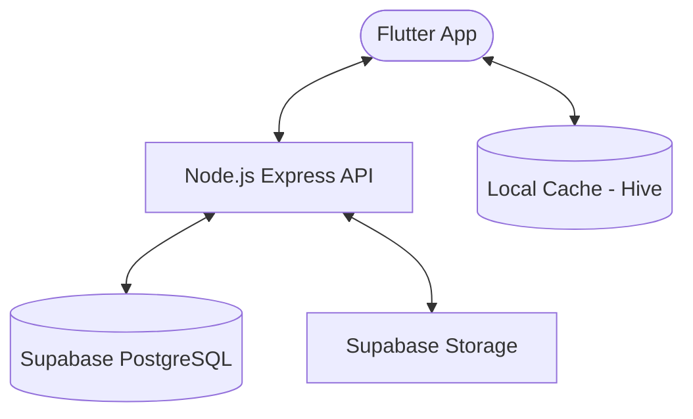

# 🎵 Full-Stack Spotify Clone


A full-stack music streaming platform built with **Flutter** and **Node.js**, replicating the core Spotify experience. Features a high-fidelity mobile UI, offline-first capabilities, and a complete artist ecosystem for uploading and managing music.

---

## 🏛 Project Overview

The repository is split into two main components:

### 1. [📱 Mobile App](./lib/README.md)

**Built with:**


- Premium UI with Hero animations and shimmer loading effects
- Offline-first caching with Hive (favorites, recent searches)
- Gesture-based player with full playback controls
- Artist dashboard for uploading albums and tracking plays
- Supported platforms: Android & iOS

### 2. [📡 Backend API](./backend/README.md)

**Built with:**


- JWT authentication with bcrypt password hashing
- Audio and image file storage via Supabase Storage
- PostgreSQL database hosted on Supabase
- Rate limiting and security headers (Helmet)
- Dockerized for easy deployment

---

## 🏗 System Architecture



### Core Workflows

1. **Authentication** — JWT-based auth flow for regular users and artists.
2. **Streaming** — Audio files are served progressively from Supabase Storage.
3. **Offline-First** — Favorites and recent searches are cached locally via Hive for an always-available experience.
4. **Artist Ecosystem** — Independent upload workflow for albums and songs, with play count tracking.

---

## 🚀 Quick Start

### Prerequisites

- [Flutter SDK](https://docs.flutter.dev/get-started/install) (Latest Stable)
- [Node.js](https://nodejs.org/) v18+
- A [Supabase](https://supabase.com) project (database + storage)

### 1. Backend Setup

```bash
cd backend
npm install
```

Create a `.env` file with your credentials:

```env
PORT=3000
SUPABASE_URL=your_supabase_url
SUPABASE_SERVICE_ROLE_KEY=your_service_role_key
JWT_SECRET=your_jwt_secret
```

```bash
npm start
```

### 2. Database Setup

Run the schema against your Supabase project:

```bash
# In Supabase SQL Editor, paste and run:
# backend/database/schema.sql
```

### 3. Flutter App Setup

```bash
flutter pub get
# Update the base URL in lib/core/constants/api_constants.dart
flutter run
```

---

## ☁️ Deployment

### Backend (Docker)

```bash
cd backend
docker-compose up -d
```

### Mobile App

```bash
# Android
flutter build apk --release

# iOS
flutter build ios --release
```

### Infrastructure

| Component | Service |
|-----------|---------|
| API | Docker on VPS (OCI, Railway, Render) |
| Database | Supabase (PostgreSQL) |
| File Storage | Supabase Storage |
| Mobile | Android / iOS |

---

> For detailed technical documentation, see the [frontend](./lib/README.md) and [backend](./backend/README.md) directories.
