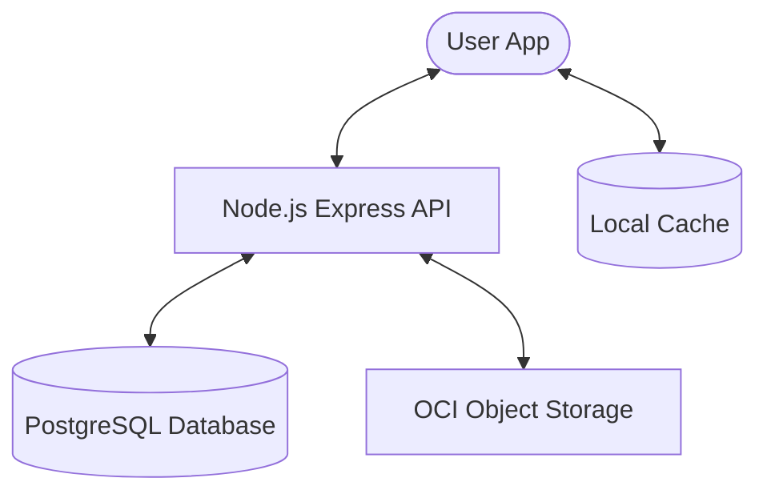

# 🎵 Full-Stack Spotify Clone


A professional, production-ready music streaming platform built with **Flutter** and **Node.js**. This project replicates the core experience of Spotify, featuring high-fidelity UI, offline-first capabilities, and a robust artist ecosystem.

---

## 🏛 Project Overview

This repository is split into two main components:

### 1. [📱 High-Fidelity Mobile App](./lib/README.md)
*   **Built with**: 
    
    
    
*   **Key Features**: Premium UI (Hero animations, Shimmers), Offline-First caching (Hive), Gesture-based player, and Artist management.
*   **Supported Platforms**: Android & iOS.

### 2. [📡 Scalable Backend API](./backend/README.md)
*   **Built with**: 
    
    
    
*   **Key Features**: JWT Security, Multimedia streaming (OCI), Multi-cloud storage integration, and Rate limiting.

---

## 🏗 System Architecture



### Core Workflows
1.  **Authentication**: Secure JWT flow for users and artists.
2.  **Streaming**: Songs are served via progressive streaming from OCI.
3.  **Offline-First**: Favorites and recent searches are cached locally for an "always-available" experience.
4.  **Artist Ecosystem**: Independent workflow for uploading albums and tracking play counts.

---

## 🚀 Quick Start

### Prerequisites
- Flutter SDK (Latest Stable)
- Node.js (v18+)
- PostgreSQL instance (or Supabase)

### 1. Setup Backend
```bash
cd backend
npm install
# Configure your .env
npm start
```

### 2. Setup Frontend
```bash
# In the root directory
flutter pub get
# Update ApiConstants with your server IP
flutter run
```

---

## ☁️ Deployment

### Infrastructure
- **API**: Deployable via Docker or directly on VPS/Cloud (Railway, Render, OCI).
- **Database**: PostgreSQL (Supabase recommended for quick setup).
- **Storage**: Oracle Cloud Infrastructure (OCI) Object Storage or Supabase Storage.

### Docker Deployment (Backend)
```bash
cd backend
docker-compose up -d
```

### Building Mobile App
```bash
# Android
flutter build apk --release
# iOS
flutter build ios --release
```

---

## 🎨 Visual Preview

| Home Screen | Player & Gestures | Artist Dashboard |
| :---: | :---: | :---: |
|  |  |  |

> [!NOTE]
> For detailed technical documentation of each component, please visit the respective directories listed above.